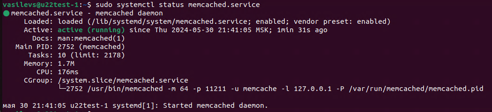
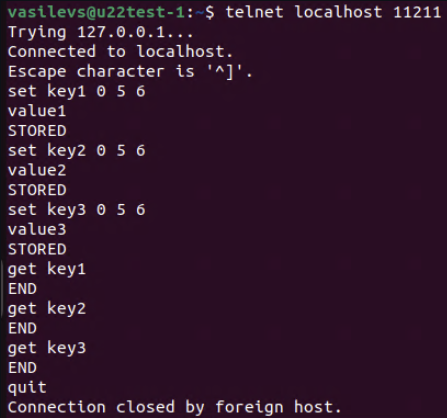
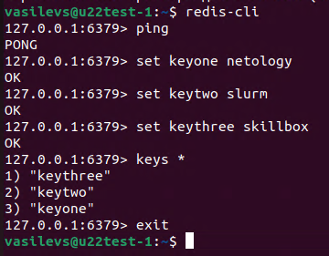

# Домашнее задание по лекции "Кеширование Redis/memcached" - SYSDB-29 - Васильев Сергей

## Задание 1. Кеширование

Приведите примеры проблем, которые может решить кеширование.

Приведите ответ в свободной форме.

### Решение 1.

1. Увеличение скорости загрузки веб-страниц: кеширование статических ресурсов, таких как изображения, CSS и JavaScript файлы, позволяет браузеру загружать их из локального кеша, вместо повторной загрузки с сервера.

2. Снижение нагрузки на сервер: кеширование ответов на запросы клиентов позволяет избежать повторных вычислений и запросов к серверу, что уменьшает нагрузку на сервер и улучшает производительность.

3. Уменьшение использования трафика: кеширование контента позволяет клиентам получать данные из кеша, вместо загрузки их с сервера, что снижает использование интернет-трафика.

## Задание 2. Memcached

Установите и запустите memcached.

Приведите скриншот systemctl status memcached, где будет видно, что memcached запущен.

### Решение 2.

## Задание 3. Удаление по TTL в Memcached

Запишите в memcached несколько ключей с любыми именами и значениями, для которых выставлен TTL 5.

Приведите скриншот, на котором видно, что спустя 5 секунд ключи удалились из базы.

### Решение 3.

## Задание 4. Запись данных в Redis

Запишите в Redis несколько ключей с любыми именами и значениями.

Через redis-cli достаньте все записанные ключи и значения из базы, приведите скриншот этой операции.

### Решение 4.

