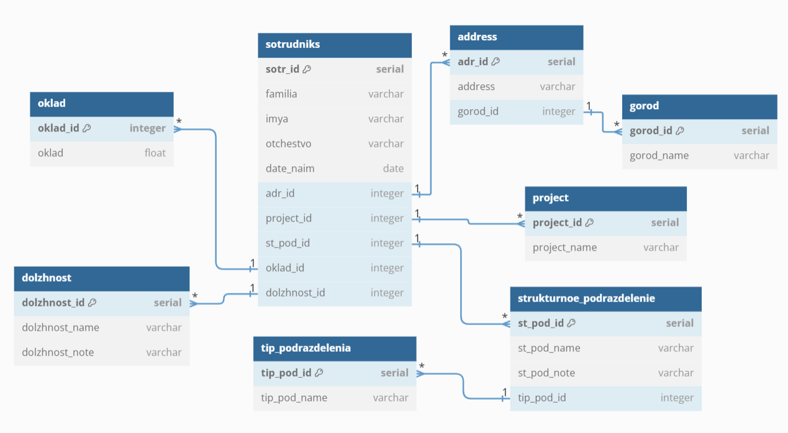

# Домашнее задание по лекции «Базы данных» - SDBSQL-29 - Васильев Сергей

## Задание 1. 
Легенда

Заказчик передал вам [файл](https://github.com/netology-code/sdb-homeworks/blob/main/resources/hw-12-1.xlsx) в формате Excel, в котором сформирован отчёт.

На основе этого отчёта нужно выполнить следующие задания.
Опишите не менее семи таблиц, из которых состоит база данных:

* какие данные хранятся в этих таблицах;
* какой тип данных у столбцов в этих таблицах, если данные хранятся в PostgreSQL.

Приведите решение к следующему виду:

Сотрудники (

* идентификатор, первичный ключ, serial,
* фамилия varchar(50),
* ...
* идентификатор структурного подразделения, внешний ключ, integer).

### Решение 1.

Кадры (

* идентификатор, первичный ключ, serial,
* фамилия varchar(20),
* имя varchar(20),
* отчество varchar(20),
* дата найма date,
* идентификатор адреса, внешний ключ, integer,
* идентификатор проекта, integer)

Оклад (

* идентификатор сотрудника, внешний ключ, integer,
* идентификатор должности, внешний ключ, integer,
* оклад float)

Адрес (

* идентификатор, первичный ключ, serial,
* Адрес varchar(50),
* идентификатор города, integer)

Город (

* идентификатор, первичный ключ, serial,
* Город varchar(50))

Должность (

* идентификатор, первичный ключ, serial,
* Должность varchar(30),
* Описание varchar(50),
* идентификатор проекта, внешний ключ, integer)

Структурное подразделение (

* идентификатор, первичный ключ, serial,
* Подразделение varchar(50),
* Описание varchar(50),
* идентификатор должности, внешний ключ, integer,
* идентификатор тип подразделения, внешний ключ, integer)

Тип подразделения (

* идентификатор, первичный ключ, serial,
* Тип подразделения varchar(50),
* идентификатор структурного подразделения, внешний ключ, integer)

Проект (

* идентификатор, первичный ключ, serial,
* Проект varchar(100))

**Доработка:**

Кадры (

* идентификатор, первичный ключ, serial,
* фамилия varchar(20),
* имя varchar(20),
* отчество varchar(20),
* дата найма date,
* идентификатор адреса, внешний ключ, integer,
* идентификатор проекта, integer,
* идентификатор оклада, внешний ключ, integer,
* идентификатор должности, внешний ключ, integer
)

Оклад (

* идентификатор оклада, первичный ключ, serial,
* оклад float)

Адрес (

* идентификатор адреса, первичный ключ, serial,
* Адрес varchar(50),
* идентификатор города, integer)

Город (

* идентификатор города, первичный ключ, serial,
* Город varchar(50))

Должность (

* идентификатор должности, первичный ключ, serial,
* Должность varchar(30),
* Описание varchar(50),

Структурное подразделение (

* идентификатор, первичный ключ, serial,
* Подразделение varchar(50),
* Описание varchar(50),
* идентификатор тип подразделения, внешний ключ, integer)

Тип подразделения (

* идентификатор, первичный ключ, serial,
* Тип подразделения varchar(50),

Проект (

* идентификатор, первичный ключ, serial,
* Проект varchar(100))

