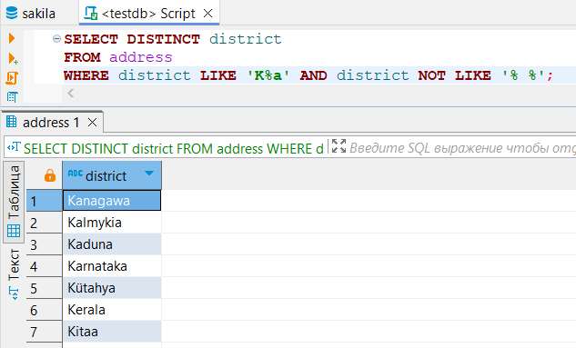
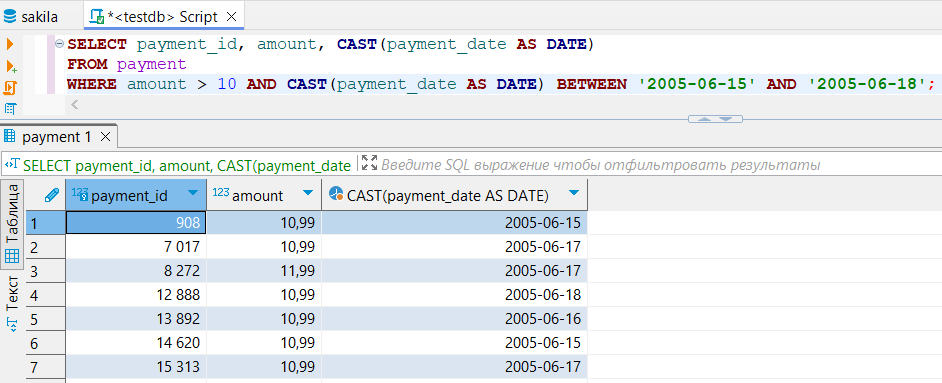
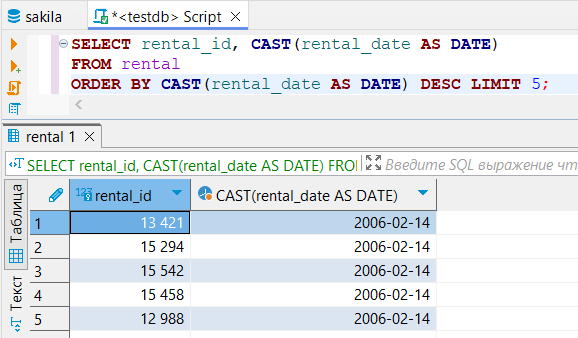
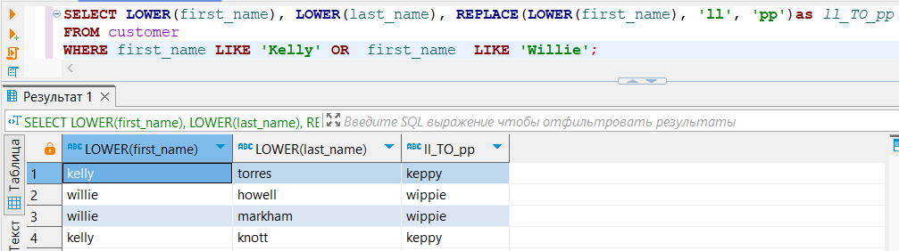

# Домашнее задание по лекции «SQL. Часть 1» - SDBSQL-29 - Васильев Сергей

## Задание 1. 
Получите уникальные названия районов из таблицы с адресами, которые начинаются на “K” и заканчиваются на “a” и не содержат пробелов.

### Решение 1.

## Задание 2. 
Получите из таблицы платежей за прокат фильмов информацию по платежам, которые выполнялись в промежуток с 15 июня 2005 года по 18 июня 2005 года включительно и стоимость которых превышает 10.00.

### Решение 2.

## Задание 3. 
Получите последние пять аренд фильмов.

### Решение 3.

## Задание 4. 
Одним запросом получите активных покупателей, имена которых Kelly или Willie.

Сформируйте вывод в результат таким образом:

все буквы в фамилии и имени из верхнего регистра переведите в нижний регистр,
замените буквы 'll' в именах на 'pp'.

### Решение 4.

