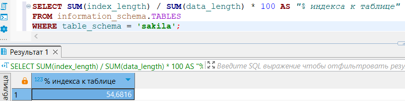
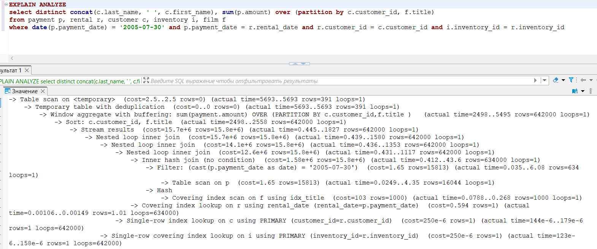
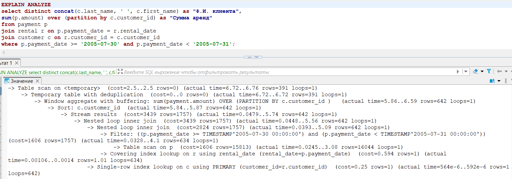
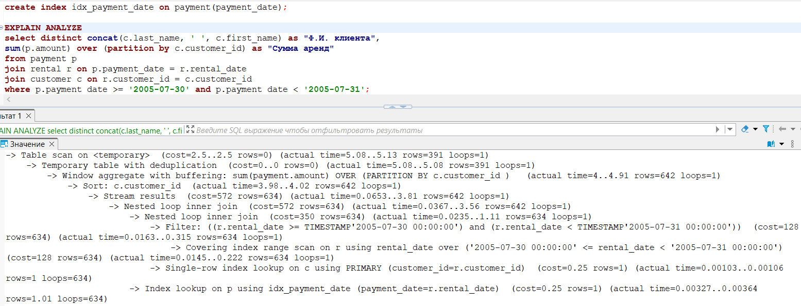

# Домашнее задание по лекции «» - SDBSQL-29 - Васильев Сергей

## Задание 1. 

Напишите запрос к учебной базе данных, который вернёт процентное отношение общего размера всех индексов к общему размеру всех таблиц.

### Решение 1.

## Задание 2. 

Выполните explain analyze следующего запроса:

    select distinct concat(c.last_name, ' ', c.first_name), sum(p.amount) over (partition by c.customer_id, f.title)
    from payment p, rental r, customer c, inventory i, film f
    where date(p.payment_date) = '2005-07-30' and p.payment_date = r.rental_date and r.customer_id = c.customer_id and i.inventory_id = r.inventory_id

* перечислите узкие места;
* оптимизируйте запрос: внесите корректировки по использованию операторов, при необходимости добавьте индексы.

### Решение 2.

Если правильно понимаю, то задача запроса сводится к выводу суммы проката клиентов на конкретную дату. Если так, то узкие места:
- отсутствие необходимости обращаться к таблицам inventory и film, т.к. никакие данные их них мы не выводим
- неявное подключение таблиц в WHERE
- Фильтрация по дате p.payment_date может быть долгой

Оригинальный запрос выполняется за 5+ секунд

Оптимизированный запрос, который у меня получился:

    select distinct concat(c.last_name, ' ', c.first_name) as "Ф.И. клиента", 
    sum(p.amount) over (partition by c.customer_id) as "Сумма аренд"
    from payment p
    join rental r on p.payment_date = r.rental_date
    join customer c on r.customer_id = c.customer_id
    where p.payment_date >= '2005-07-30' and p.payment_date < '2005-07-31';

Оптимизированный запрос выполняется за чуть меньше, чем одна мили секунды.

Создание индекса не особенно сильно меняет картину к лучшему, что не исключает, что индекс будет работать лучше, в случае если количество дат будет исчисляться не 16к, а сотнями тысяч, либо даже миллионами.

## Задание 3. 

Самостоятельно изучите, какие типы индексов используются в PostgreSQL. Перечислите те индексы, которые используются в PostgreSQL, а в MySQL — нет.

Приведите ответ в свободной форме.

### Решение 3.

GIN (Generalized Inverted Index): Этот тип индекса используется для работы с массивами, JSONB и полными текстовыми данными. Он позволяет эффективно выполнять запросы, которые ищут элементы внутри массивов или документов.

GiST (Generalized Search Tree): GiST — это универсальный индекс, который может использоваться для различных типов данных, включая геометрические и полнотекстовые данные. GiST позволяет создавать пользовательские индексы для нестандартных типов данных.

BRIN (Block Range INdex): Этот тип индекса предназначен для работы с очень большими таблицами, где данные имеют некоторую степень упорядоченности. BRIN хранит минимальные и максимальные значения для блоков данных, что позволяет эффективно выполнять запросы с диапазонами.

SP-GiST (Space-Partitioned Generalized Search Tree): Этот индекс подходит для работы с данными, которые могут быть разбиты на пространственные области, такими как географические данные. SP-GiST оптимален для определенных типов данных, таких как точки, линии и полигоны.

Bloom Index: Этот тип индекса используется для уменьшения количества проверок на наличие значений в больших таблицах. Bloom индексы могут быть полезны для оптимизации запросов, особенно когда нужно проверить наличие множества значений.

Hash Index: Хотя в MySQL также есть хеш-индексы, в PostgreSQL они могут использоваться более эффективно и поддерживают более широкий набор функций, включая возможность использования в качестве уникальных индексов.

