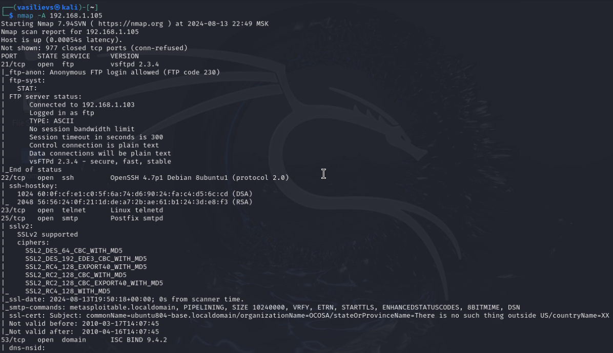
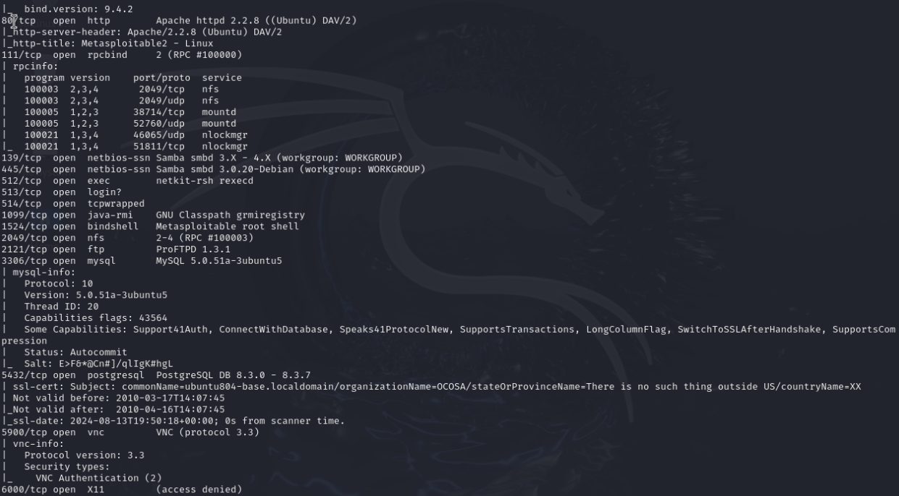
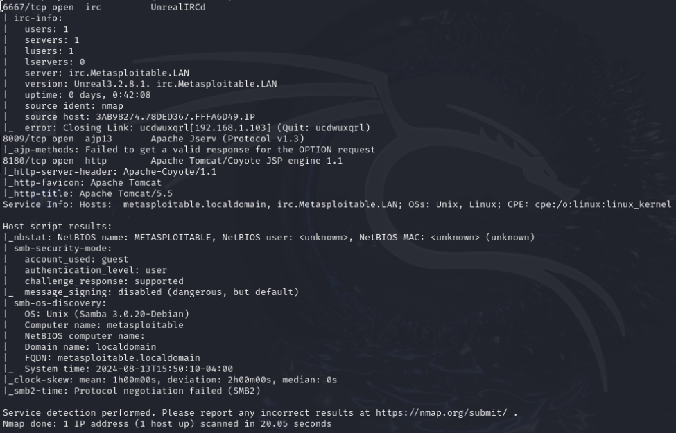

# Домашнее задание по лекции ««Уязвимости и атаки на информационные системы»» - SYSSEC-29 - Васильев Сергей

## Задание 1. 

Скачайте и установите виртуальную машину Metasploitable: https://sourceforge.net/projects/metasploitable/.

Это типовая ОС для экспериментов в области информационной безопасности, с которой следует начать при анализе уязвимостей.

Просканируйте эту виртуальную машину, используя nmap.

Попробуйте найти уязвимости, которым подвержена эта виртуальная машина.

Сами уязвимости можно поискать на сайте https://www.exploit-db.com/.

Для этого нужно в поиске ввести название сетевой службы, обнаруженной на атакуемой машине, и выбрать подходящие по версии уязвимости.

Ответьте на следующие вопросы:

Какие сетевые службы в ней разрешены?
Какие уязвимости были вами обнаружены? (список со ссылками: достаточно трёх уязвимостей)

Приведите ответ в свободной форме.

### Решение 1.
Результат агрессивного сканирования хоста metasploitable2:

[Найдена уязвимость сервер FTP](https://www.exploit-db.com/exploits/49757)

[Найдена уязвимость сервер BIND](https://www.exploit-db.com/exploits/6122)

[Найдена уязвимость сервер SAMBA](https://www.exploit-db.com/exploits/7701)

[Найдена уязвимость сервер ProFTPd](https://www.exploit-db.com/exploits/15449)

[Найдена уязвимость сервер APACHE TOMCAT](https://www.exploit-db.com/exploits/12343)

## Задание 2. 

Проведите сканирование Metasploitable в режимах SYN, FIN, Xmas, UDP.

Запишите сеансы сканирования в Wireshark.

Ответьте на следующие вопросы:

Чем отличаются эти режимы сканирования с точки зрения сетевого трафика?
Как отвечает сервер?

Приведите ответ в свободной форме.

### Решение 2.

SIN - это процесс сканирования с частичным установлением соединения, когда соединение не завершается полностью. Сначала на определенный порт отправляется сообщение SYN, после чего ожидается ответ, который помогает определить состояние порта. Если приходит ответ SYN-ACK, это означает, что порт открыт и прослушивается, тогда как ответ RST указывает на то, что он не прослушивается. Если после нескольких запросов ответ не поступает или приходит ICMP-сообщение об ошибке достижимости, то это также сигнализирует о проблеме.

FIN - это процесс сканирования, при котором отправляются запросы с единственным установленным флагом контроля соединения - FIN. В отличие от запросов SYN, большинство брандмауэров не блокируют такие единицы данных (PDU). На запросы к закрытому порту обычно приходит ответ RST (разрыв соединения), тогда как открытый порт не реагирует.

Xmas — это метод сканирования, который заключается в отправке пакетов с различными флагами для проверки состояния соединения. В результате сканирования Xmas можно получить три возможных состояния порта:

* Open-filtered — невозможно установить, открыт ли порт или он отфильтрован. Даже в случае, если порт открыт, сканирование Xmas будет сообщать о нем как open-filtered, если ответ не был получен (даже после повторной отправки).
 
* Closed — если приходит ответ в виде сообщения RST.

* Filtered - брандмауэр осуществляет фильтрацию сканируемых портов; это происходит в случае получения ответа с ошибкой ICMP unreachable

UDP - отправляется запрос, и если порт закрыт, приходит ответ «Destination unreachable». Если порт открыт, ответ не поступает. Поскольку целевой порт не отвечает, этот метод сканирования довольно медленный.